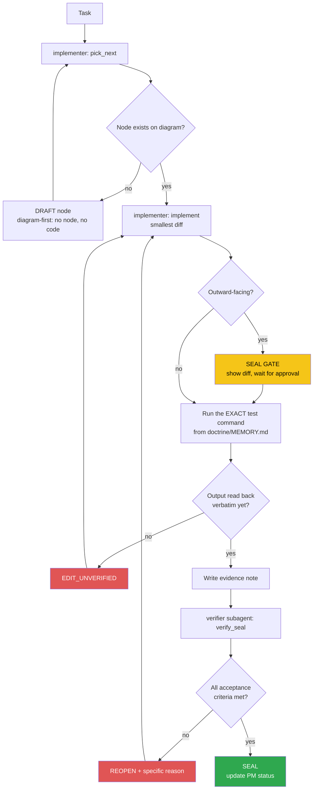

<!-- Diagram: dev-loop -->
<!-- Dev loop: plan - implement - verify - seal -->
DNA: 'smallest_diff / edit_x_read_back_proof_x_independent_verdict'
Auth: 65537 | Version: 1.0.0
Law: LAI-13 - monotonic ratchet (PENDING -> IN_PROGRESS -> SEALED, never demote)

> Every repo code change enters here and exits as SEALED or REOPENED — no
> other state exists in between.

## PM status
| Node | State | Notes |
|---|---|---|
| `fix-chrome-executable-path` | PENDING | `src/services/createPDF.ts:14-25` — Chrome executable path hardcoded, breaks PDF export in CI/Docker. See Traps in `doctrine/domains/PROJECT.md`. First candidate node. |
| `fix-redis-init-blocks-dev-startup` | SEALED | `src/services/redis.ts:36` — `await redisClient.connect()` had no timeout; redis v4's default `reconnectStrategy: retries => Math.min(retries*50,500)` retries forever when Redis is down. `server.ts:125` `await initRedis()` runs before `app.listen()` → server hangs forever, port never opens, whenever `REDIS_URL` points at an unreachable Redis. Found by actually running `npm run dev` (task: "run npm run dev and fix the bug"). Fix shipped in `f355e2f` (2026-08-21), zero further diff needed. SEALED 2026-08-22 after a second re-verification note fixed the prior REOPEN's two gaps (truncated log line, unsubstantiated timing claim) with clean, untruncated, cross-consistent citations — see `evidence/verifier/2026-08-22/fix-redis-init-blocks-dev-startup-seal.md`. |
| `fix-idor-broken-access-control` | PENDING | **Critical.** All CRUD APIs for candidate_profile (education/experience/award/certificate/project/reference/generalInformation) + `candidate.service.ts` + `fnExportPDF` never cross-check `candidateId`/`_id` against `req.user._id` (JWT) — they trust client-supplied `req.body.candidateId`/`_id`. Live-tested confirmed: User B could read/delete/edit User A's data, overwrite A's profile. Root cause: `verifyToken.middleware.ts` sets `req.user` but nothing cross-checks it. Found while testing the full API (task: "test the whole API again"). |
| `fix-candidate-password-leak` | PENDING | `src/candidate/candidate.service.ts` — `handlerGetInformationByEmail` has no `.select()` at all; `handlerGetInformationById` double-wraps `whitelistSelect([select])`, making the select a permanent no-op. Result: `GET /api/v1/candidate/:email` and `PUT/PATCH /candidate/update` return the raw bcrypt password hash in the response. |
| `fix-refresh-token-expiry-unused` | PENDING | `TOKEN_EXP_IN` (`.env`, already exported in config) is never used at any `jwtSign()` call site (`auth.service.ts`, `auth.controller.ts`, `api/v1/auth/services/login.ts`) — access and refresh tokens always share the same default 1h expiry, so the refresh token is pointless. |
| `fix-v2-register-missing-await` | PENDING | `src/api/v1/auth/services/register.ts:44` — `bcryptGenerateSalt(password)` missing `await`, the Promise gets assigned straight into the Mongoose model's password field → every `POST /api/v2/auth/register` fails with a Promise→string cast error. |
| `fix-create-response-null-id` | PENDING | Minor. `BaseService.ts` `handlerCreate`'s `hookAfterSave` reassigns the local destructured `data` variable, never actually updating what `baseCreateDocument` returns → every `POST .../create` response has `data._id: null` instead of the real new ID. |
| `add-candidate-self-delete` | PENDING | Feature (not a bug). No endpoint lets a candidate delete their own account — needed to clean up 2 test accounts created during live-verification of the 5 bug fixes above on production (`livecheck+...@example.com`, `livecheckB+...@example.com`). Requirement: `DELETE /api/v1/candidate`, using only `req.user._id` (never an id from the client — follows the IDOR-safe pattern from `fix-idor-broken-access-control`), cascade-deletes data across all 7 CV section models by `candidateId`. |
| `feat-multilang-resume-content` | PENDING | Feature, GitHub issue #79. Localize 8 free-text description fields (`Candidate.introduction`, `description` on 5 CV sections, `generalInformation.career`/`careerGoal`) from flat `String` to `{vi, en}`. Does NOT touch proper-name/short-label fields (`school`/`company`/`position`/`positionDesired`/`levelCurrent`/...). `?lang=` resolves to a single string for `GET /api/me/:email` + PDF export; authenticated CRUD returns the full `{vi,en}`. Migration script `src/scripts/migrate-localize-text-fields.ts` (`npm run migrate:localize-text`), idempotent — actually run, confirmed via evidence. **Correction**: an earlier note here said "no access to production DB" — WRONG, local `.env` actually points at the same real-data Atlas cluster (see `fix-candidate-me-candidateid-not-string`). |
| `fix-candidate-me-candidateid-not-string` | PENDING | **Critical, found by accident while testing #79.** `candidate_me/index.ts` `handlerGetAboutMe` — `_id` from the raw Mongoose document is an ObjectId instance, passed straight into `idQuerySafe.safeQuery({}, { candidateId: _id })` — `QuerySafe.safeQuery` only accepts `typeof value === 'string'`, so an ObjectId silently fails that check and `candidateId` gets dropped from the filter → `model.find({})` returns CV data (education/experience/award/certificate/project/generalInformation) for **every candidate mixed together**, on every `GET /api/me/:email` request (public, no auth) and `/download-pdf`. Live-tested confirmed: a brand-new candidate profile returned real data belonging to `votan.it@gmail.com`. Fix: `.toString()` on `_id` before passing it in. |
| `feat-i18n-api-messages-auth` | PENDING | Feature, GitHub issue #78 (phase 1 of several). i18n infrastructure (hand-rolled `t(key, lang)`, reads `locales/vi.json`/`en.json`, middleware detects `Accept-Language`, defaults `vi`) + fully migrates the auth flow (register/login/logout/refresh). Does NOT migrate Joi validation messages (different architecture — Joi schemas are built once at module load with no request context; needs error TYPE → i18n key mapping, left as a follow-up). Does NOT touch candidate/CV section messages (separate follow-up). |
| `feat-i18n-full-coverage` | PENDING | Feature, GitHub issue #78 (phase 2/2 — complete). Joi validation messages: a generic system translating by `detail.type` + `fieldLabels` (`utils/valid.ts`), no longer relying on hardcoded `.messages()` per schema. Mongoose `required` messages: same approach in `handleError` (`utils/helper.ts`). Every candidate/CV section success/error message (`services/index.ts`, `BaseController.ts`, `BaseService.ts`, `candidate.service.ts`, `generalInformation.*`) cascades across all 7 CV sections. Bug found during implementation: `t()`'s dot-path walker misparsed Joi type strings containing a dot (`any.required` was read as 3 nested levels) — caught via a real live test (curl in 2 languages), not code review. Fix: a dedicated `tErrorType()` function, flat lookup with no dot-path walking. |

| `add-forgot-reset-password-flow` | SEALED | Feature, GitHub issue #70. `POST /api/v1/auth/forgot-password` + `POST /api/v1/auth/reset-password`. No email-sending infra exists in the repo (confirmed by grep — no nodemailer/SMTP/SendGrid/SES dep or config anywhere). Operator decision (asked via `AskUserQuestion`): stub delivery — generate a single-use TTL reset token (same Redis/mem pattern as `utils/tokenBlacklist.ts`), log the reset link instead of emailing it (dev-only stand-in). Real email delivery is out of scope, follow-up issue if/when a provider is chosen. See `evidence/implementer/2026-08-25/forgot-password-reset-flow-plan.md` for the ambiguity this resolves. SEALED 2026-08-25 — independent verifier subagent read the actual `src/` diff (not just the note), ran `npm test` itself (9 suites, 49/49 passed, +4 new tests, zero regressions), ran `tsc --noEmit` clean, confirmed the reset-token store structurally matches `utils/tokenBlacklist.ts`, confirmed single-use consumption and no user-enumeration leak by code + test, and confirmed no real email is sent anywhere — see `evidence/verifier/2026-08-25/add-forgot-reset-password-flow-seal.md`. |

Any regression must be a **new node** (LAI-13) — never edit an existing
node's PM status directly to "undo" an existing SEAL.
