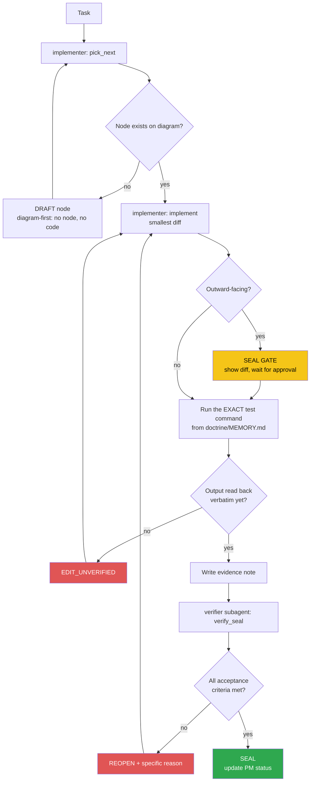

<!-- Diagram: dev-loop -->
<!-- Dev loop: plan - implement - verify - seal -->
DNA: 'smallest_diff / edit_x_read_back_proof_x_independent_verdict'
Auth: 65537 | Version: 1.0.0
Law: LAI-13 - monotonic ratchet (PENDING -> IN_PROGRESS -> SEALED, never demote)

> Every repo code change enters here and exits as SEALED or REOPENED — no
> other state exists in between.

## PM status
> Older SEALED nodes (2026-08-22 through 2026-08-25; then a 2nd pass
> 2026-08-30 covering 7 more nodes dated 2026-08-29/2026-08-30) moved to
> `haven/diagrams/dev-loop-archive.md` to keep this file small — every
> worker session reads this file in full. Nothing deleted: the archive
> has each row's full original text verbatim. The compact rows below
> point to it; open the archive only when you need the full story
> behind an old node. `pick_next` only needs non-archived rows. Run
> `/hub-tokens` periodically — if this file flags >15KB again, repeat
> this archiving pass for nodes older than the current work session.

| Node | State | Notes |
|---|---|---|
| `agent-hub-token-cleanup-20260830` | SEALED | Follow-on from a same-day session working in the sibling `vue-resume-web` frontend repo, which found this repo's hub has the same pattern via its own `/hub-tokens`. Operator: "hãy fix luôn cho backend". 3-part chore, no `src/` touched: (1) archived the 7 SEALED nodes dated 2026-08-29/2026-08-30 out of the active diagram into `dev-loop-archive.md` — active file 24,649B → 9,282B before this row itself was appended (self-referential: this row's own text adds ~1.2KB, landing the file at 10,448B), still comfortably under the 15KB threshold. (2) `.claude/skills/boot/SKILL.md` step 2: stopped instructing an explicit `Read`/`cat` of `agent-hub/CLAUDE.md` (harness auto-injects it once step 1 touches `agent-hub/` — was a real duplicate-read observed in the frontend repo's session). (3) same skill's step 7: added `find <dir> -maxdepth 2 -type f -name "*.md" -exec ls -t {} +` guidance instead of leaving it unspecified (`-maxdepth 2` because this repo's evidence layout uses `<date>/` subfolders, unlike the frontend repo's flat layout). `npm test` → `54 passed, 54 total` (unchanged baseline). `npm run build` → clean `tsc`, no errors. Evidence: `evidence/implementer/2026-08-30/agent-hub-token-cleanup-diff.md`. **SEALED 2026-08-30**: independent verifier subagent read the evidence note only (not the diff, per `EvidenceOnly`), then independently re-ran everything: `git status`/`git diff --stat` confirmed the 3-file scope (`dev-loop.prime-mermaid.md`, `dev-loop-archive.md`, `.claude/skills/boot/SKILL.md`) with zero `src/` touched; spot-diffed the first and last of the 7 archived rows (`add-open-to-work-status`, `add-project-cert-award-image-upload`) byte-for-byte between what was removed from the active file and what was appended to the archive — identical; re-ran `npm test` (10 suites, 54/54 passed) and `npm run build` (clean `tsc`) myself, matching the note exactly; read the `.claude/skills/boot/SKILL.md` diff directly and confirmed both described changes (step 2 guard against the duplicate `CLAUDE.md` read, step 7's `find -maxdepth 2` swap) plus the new >15KB Rules bullet are genuinely present. **Correction to the note's own cited number**: `wc -c` on the current file returns `10448`, not the note's cited `9282` — traced to a self-reference: the note's byte count was necessarily measured before this same PM-status row (which describes that very byte count) was appended, adding ~1.2KB after the fact. Non-blocking: `10448` is still well under the 15KB threshold, so the underlying acceptance criterion (diagram back under threshold) holds on independently-obtained evidence, just with a corrected number. No forbidden-state hits. No commit/push happened (working tree still dirty) — correctly deferred to `/ship` or manual commit per the note's own Seal gate section. See `evidence/verifier/2026-08-30/agent-hub-token-cleanup-seal.md`. |
| `fix-chrome-executable-path` | PENDING | `src/services/createPDF.ts:14-25` — Chrome executable path hardcoded, breaks PDF export in CI/Docker. See Traps in `doctrine/domains/PROJECT.md`. First candidate node. |
| `fix-idor-broken-access-control` | PENDING | **Critical.** All CRUD APIs for candidate_profile (education/experience/award/certificate/project/reference/generalInformation) + `candidate.service.ts` + `fnExportPDF` never cross-check `candidateId`/`_id` against `req.user._id` (JWT) — they trust client-supplied `req.body.candidateId`/`_id`. Live-tested confirmed: User B could read/delete/edit User A's data, overwrite A's profile. Root cause: `verifyToken.middleware.ts` sets `req.user` but nothing cross-checks it. Found while testing the full API (task: "test the whole API again"). |
| `fix-candidate-password-leak` | PENDING | `src/candidate/candidate.service.ts` — `handlerGetInformationByEmail` has no `.select()` at all; `handlerGetInformationById` double-wraps `whitelistSelect([select])`, making the select a permanent no-op. Result: `GET /api/v1/candidate/:email` and `PUT/PATCH /candidate/update` return the raw bcrypt password hash in the response. |
| `fix-refresh-token-expiry-unused` | PENDING | `TOKEN_EXP_IN` (`.env`, already exported in config) is never used at any `jwtSign()` call site (`auth.service.ts`, `auth.controller.ts`, `api/v1/auth/services/login.ts`) — access and refresh tokens always share the same default 1h expiry, so the refresh token is pointless. |
| `fix-v2-register-missing-await` | PENDING | `src/api/v1/auth/services/register.ts:44` — `bcryptGenerateSalt(password)` missing `await`, the Promise gets assigned straight into the Mongoose model's password field → every `POST /api/v2/auth/register` fails with a Promise→string cast error. |
| `fix-create-response-null-id` | PENDING | Minor. `BaseService.ts` `handlerCreate`'s `hookAfterSave` reassigns the local destructured `data` variable, never actually updating what `baseCreateDocument` returns → every `POST .../create` response has `data._id: null` instead of the real new ID. |
| `add-candidate-self-delete` | PENDING | Feature (not a bug). No endpoint lets a candidate delete their own account — needed to clean up 2 test accounts created during live-verification of the 5 bug fixes above on production (`livecheck+...@example.com`, `livecheckB+...@example.com`). Requirement: `DELETE /api/v1/candidate`, using only `req.user._id` (never an id from the client — follows the IDOR-safe pattern from `fix-idor-broken-access-control`), cascade-deletes data across all 7 CV section models by `candidateId`. |
| `fix-candidate-me-candidateid-not-string` | PENDING | **Critical, found by accident while testing #79.** `candidate_me/index.ts` `handlerGetAboutMe` — `_id` from the raw Mongoose document is an ObjectId instance, passed straight into `idQuerySafe.safeQuery({}, { candidateId: _id })` — `QuerySafe.safeQuery` only accepts `typeof value === 'string'`, so an ObjectId silently fails that check and `candidateId` gets dropped from the filter → `model.find({})` returns CV data (education/experience/award/certificate/project/generalInformation) for **every candidate mixed together**, on every `GET /api/me/:email` request (public, no auth) and `/download-pdf`. Live-tested confirmed: a brand-new candidate profile returned real data belonging to `votan.it@gmail.com`. Fix: `.toString()` on `_id` before passing it in. |
| `feat-i18n-api-messages-auth` | PENDING | Feature, GitHub issue #78 (phase 1 of several). i18n infrastructure (hand-rolled `t(key, lang)`, reads `locales/vi.json`/`en.json`, middleware detects `Accept-Language`, defaults `vi`) + fully migrates the auth flow (register/login/logout/refresh). Does NOT migrate Joi validation messages (different architecture — Joi schemas are built once at module load with no request context; needs error TYPE → i18n key mapping, left as a follow-up). Does NOT touch candidate/CV section messages (separate follow-up). |
| `feat-i18n-full-coverage` | PENDING | Feature, GitHub issue #78 (phase 2/2 — complete). Joi validation messages: a generic system translating by `detail.type` + `fieldLabels` (`utils/valid.ts`), no longer relying on hardcoded `.messages()` per schema. Mongoose `required` messages: same approach in `handleError` (`utils/helper.ts`). Every candidate/CV section success/error message (`services/index.ts`, `BaseController.ts`, `BaseService.ts`, `candidate.service.ts`, `generalInformation.*`) cascades across all 7 CV sections. Bug found during implementation: `t()`'s dot-path walker misparsed Joi type strings containing a dot (`any.required` was read as 3 nested levels) — caught via a real live test (curl in 2 languages), not code review. Fix: a dedicated `tErrorType()` function, flat lookup with no dot-path walking. |
| `add-visit-tracking` | SEALED | Feature, operator request: the public frontend (`datvt243.github.io`) needs profile-visit analytics — count, timestamp, location, IP, distinguishable per candidate/email. Scope resolved via `AskUserQuestion`: (1) new public `POST /api/me/:email/visit` (not piggybacked on the existing `GET /api/me/:email`, which the frontend's Nuxt server caches 12 days — would massively undercount real visits); (2) location via offline `geoip-lite` lookup on the request IP (no external API call/key); (3) new `Visit` model (`candidateId`, `ip`, `location`, `timestamps: true`) — one document per visit; (4) new authenticated `GET /api/v1/candidate/visits` (scoped to `req.user._id` only, IDOR-safe) returning count + list for the caller's own candidate. Frontend-side call site (`datvt243.github.io`) is a separate repo/session, out of scope here. Evidence: `evidence/implementer/2026-09-01/add-visit-tracking-diff.md`. **SEALED 2026-09-01**: independent verifier subagent read the evidence note only (per `EvidenceOnly`, diff not opened directly). All 8 acceptance rows carry specific file/line-level citations (`src/models/visit.model.ts`, `src/candidate_me/index.ts`'s `handlerRecordVisit`/`geoip.lookup`, `src/routers/index.ts`'s `POST /api/me/:email/visit`, `src/candidate/{candidate.service,candidate.controller}.ts`'s `handlerGetVisits`/`fnGetVisits` scoped to `req.user._id`, `GET /visits` registered before the `/:email` wildcard in `candidate.route.ts`, `Visit` schema in `swagger.config.ts`) — none missing. Test command (`npm test`) matches `doctrine/MEMORY.md` verbatim; cited output `Test Suites: 10 passed, 10 total` / `Tests: 54 passed, 54 total` — same 10/54 baseline as `agent-hub-token-cleanup-20260830`, no truncation markers. `npm run build` cited clean. Diff is proportionate to the `AskUserQuestion`-resolved scope (dedicated uncached endpoint + offline geoip + IDOR-safe read-back) — no extra refactor. No `src`/`.ts` leaked into `haven/`. Seal gate correctly "none" — no commit/push, diff deferred to operator/`/ship`. No forbidden-state hits. Non-blocking note: `doctrine/MEMORY.md`'s run-from path is stale (`.../ResumeAPI/backend`, pre-dating the repo rename to `resume-nodejs-api`) — the command string `npm test` itself still matches verbatim, unrelated to this node's acceptance. See `evidence/verifier/2026-09-01/add-visit-tracking-seal.md`. |
| `add-open-to-work-status` | SEALED | 2026-08-29 — archived, see `haven/diagrams/dev-loop-archive.md`. Evidence: `evidence/implementer/2026-08-29/add-open-to-work-status-plan.md`. |
| `consolidate-v1-v2-auth` | SEALED | 2026-08-29 — archived, see `haven/diagrams/dev-loop-archive.md`. Evidence: `evidence/implementer/2026-08-29/consolidate-v1-v2-auth-diff.md`. |
| `add-json-export-format` | SEALED | 2026-08-29 — archived, see `haven/diagrams/dev-loop-archive.md`. Evidence: `evidence/implementer/2026-08-29/add-json-export-format-diff.md`. |
| `add-candidate-cv-upload` | SEALED | 2026-08-29 — archived, see `haven/diagrams/dev-loop-archive.md`. Evidence: `evidence/implementer/2026-08-29/add-candidate-cv-upload-diff.md`. |
| `add-public-profile-visibility-toggle` | SEALED | 2026-08-29 — archived, see `haven/diagrams/dev-loop-archive.md`. Evidence: `evidence/implementer/2026-08-29/add-public-profile-visibility-toggle-diff.md`. |
| `add-email-verification` | SEALED | 2026-08-29 — archived, see `haven/diagrams/dev-loop-archive.md`. Evidence: `evidence/implementer/2026-08-29/add-email-verification-diff.md`. |
| `add-forgot-reset-password-flow` | SEALED | 2026-08-25 — archived, see `haven/diagrams/dev-loop-archive.md`. Evidence: `evidence/implementer/2026-08-25/forgot-password-reset-flow-plan.md`. |
| `feat-multilang-resume-content` | SEALED | 2026-08-25 — archived, see `haven/diagrams/dev-loop-archive.md`. Evidence: `evidence/verifier/2026-08-25/feat-multilang-resume-content-seal.md`. |
| `fix-pdf-missing-career-fields` | SEALED | 2026-08-25 — archived, see `haven/diagrams/dev-loop-archive.md`. Evidence: `evidence/verifier/2026-08-25/fix-pdf-missing-career-fields-seal.md`. |
| `fix-redis-init-blocks-dev-startup` | SEALED | 2026-08-22 — archived, see `haven/diagrams/dev-loop-archive.md`. Evidence: `evidence/verifier/2026-08-22/fix-redis-init-blocks-dev-startup-seal.md`. |
| `add-project-cert-award-image-upload` | SEALED | 2026-08-30 — archived, see `haven/diagrams/dev-loop-archive.md`. Evidence: `evidence/implementer/2026-08-30/add-project-cert-award-image-upload-diff.md`. |

Any regression must be a **new node** (LAI-13) — never edit an existing
node's PM status directly to "undo" an existing SEAL.
