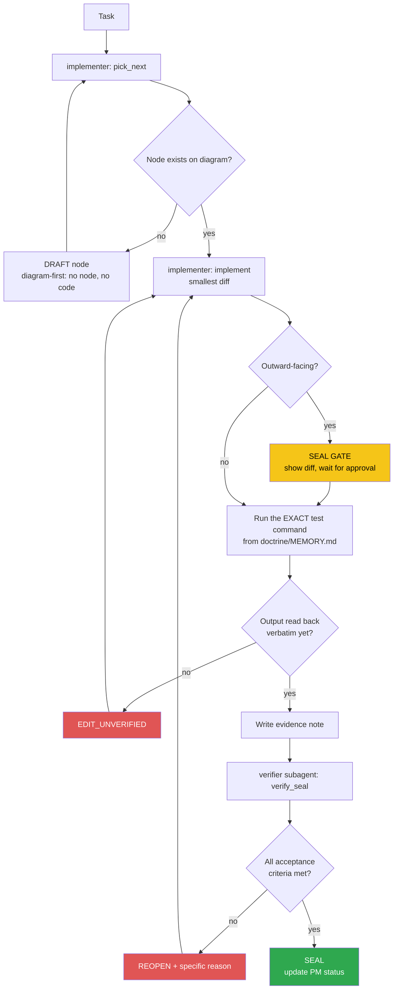

<!-- Diagram: dev-loop -->
<!-- Dev loop: plan - implement - verify - seal -->
DNA: 'smallest_diff / edit_x_read_back_proof_x_independent_verdict'
Auth: 65537 | Version: 1.0.0
Law: LAI-13 - monotonic ratchet (PENDING -> IN_PROGRESS -> SEALED, never demote)

> Every repo code change enters here and exits as SEALED or REOPENED — no
> other state exists in between.

## PM status
> Older SEALED nodes (2026-08-22 through 2026-08-25) moved to
> `haven/diagrams/dev-loop-archive.md` to keep this file small — every
> worker session reads this file in full. Nothing deleted: the archive
> has each row's full original text verbatim. The compact rows below
> point to it; open the archive only when you need the full story
> behind an old node. `pick_next` only needs non-archived rows.

| Node | State | Notes |
|---|---|---|
| `fix-chrome-executable-path` | PENDING | `src/services/createPDF.ts:14-25` — Chrome executable path hardcoded, breaks PDF export in CI/Docker. See Traps in `doctrine/domains/PROJECT.md`. First candidate node. |
| `fix-idor-broken-access-control` | PENDING | **Critical.** All CRUD APIs for candidate_profile (education/experience/award/certificate/project/reference/generalInformation) + `candidate.service.ts` + `fnExportPDF` never cross-check `candidateId`/`_id` against `req.user._id` (JWT) — they trust client-supplied `req.body.candidateId`/`_id`. Live-tested confirmed: User B could read/delete/edit User A's data, overwrite A's profile. Root cause: `verifyToken.middleware.ts` sets `req.user` but nothing cross-checks it. Found while testing the full API (task: "test the whole API again"). |
| `fix-candidate-password-leak` | PENDING | `src/candidate/candidate.service.ts` — `handlerGetInformationByEmail` has no `.select()` at all; `handlerGetInformationById` double-wraps `whitelistSelect([select])`, making the select a permanent no-op. Result: `GET /api/v1/candidate/:email` and `PUT/PATCH /candidate/update` return the raw bcrypt password hash in the response. |
| `fix-refresh-token-expiry-unused` | PENDING | `TOKEN_EXP_IN` (`.env`, already exported in config) is never used at any `jwtSign()` call site (`auth.service.ts`, `auth.controller.ts`, `api/v1/auth/services/login.ts`) — access and refresh tokens always share the same default 1h expiry, so the refresh token is pointless. |
| `fix-v2-register-missing-await` | PENDING | `src/api/v1/auth/services/register.ts:44` — `bcryptGenerateSalt(password)` missing `await`, the Promise gets assigned straight into the Mongoose model's password field → every `POST /api/v2/auth/register` fails with a Promise→string cast error. |
| `fix-create-response-null-id` | PENDING | Minor. `BaseService.ts` `handlerCreate`'s `hookAfterSave` reassigns the local destructured `data` variable, never actually updating what `baseCreateDocument` returns → every `POST .../create` response has `data._id: null` instead of the real new ID. |
| `add-candidate-self-delete` | PENDING | Feature (not a bug). No endpoint lets a candidate delete their own account — needed to clean up 2 test accounts created during live-verification of the 5 bug fixes above on production (`livecheck+...@example.com`, `livecheckB+...@example.com`). Requirement: `DELETE /api/v1/candidate`, using only `req.user._id` (never an id from the client — follows the IDOR-safe pattern from `fix-idor-broken-access-control`), cascade-deletes data across all 7 CV section models by `candidateId`. |
| `fix-candidate-me-candidateid-not-string` | PENDING | **Critical, found by accident while testing #79.** `candidate_me/index.ts` `handlerGetAboutMe` — `_id` from the raw Mongoose document is an ObjectId instance, passed straight into `idQuerySafe.safeQuery({}, { candidateId: _id })` — `QuerySafe.safeQuery` only accepts `typeof value === 'string'`, so an ObjectId silently fails that check and `candidateId` gets dropped from the filter → `model.find({})` returns CV data (education/experience/award/certificate/project/generalInformation) for **every candidate mixed together**, on every `GET /api/me/:email` request (public, no auth) and `/download-pdf`. Live-tested confirmed: a brand-new candidate profile returned real data belonging to `votan.it@gmail.com`. Fix: `.toString()` on `_id` before passing it in. |
| `feat-i18n-api-messages-auth` | PENDING | Feature, GitHub issue #78 (phase 1 of several). i18n infrastructure (hand-rolled `t(key, lang)`, reads `locales/vi.json`/`en.json`, middleware detects `Accept-Language`, defaults `vi`) + fully migrates the auth flow (register/login/logout/refresh). Does NOT migrate Joi validation messages (different architecture — Joi schemas are built once at module load with no request context; needs error TYPE → i18n key mapping, left as a follow-up). Does NOT touch candidate/CV section messages (separate follow-up). |
| `feat-i18n-full-coverage` | PENDING | Feature, GitHub issue #78 (phase 2/2 — complete). Joi validation messages: a generic system translating by `detail.type` + `fieldLabels` (`utils/valid.ts`), no longer relying on hardcoded `.messages()` per schema. Mongoose `required` messages: same approach in `handleError` (`utils/helper.ts`). Every candidate/CV section success/error message (`services/index.ts`, `BaseController.ts`, `BaseService.ts`, `candidate.service.ts`, `generalInformation.*`) cascades across all 7 CV sections. Bug found during implementation: `t()`'s dot-path walker misparsed Joi type strings containing a dot (`any.required` was read as 3 nested levels) — caught via a real live test (curl in 2 languages), not code review. Fix: a dedicated `tErrorType()` function, flat lookup with no dot-path walking. |
| `add-open-to-work-status` | SEALED | Feature. Added `openToWork: Boolean` (default `false`) to `generalInformation.model.ts` — a job-seeking status flag, same group as `workLocation`/`workForm`. Scope confirmed via `AskUserQuestion` (operator): `generalInformation` model (not `Candidate`), Boolean type (not enum), API-response-only — `createPDF.ts` explicitly out of scope. See `evidence/implementer/2026-08-29/add-open-to-work-status-plan.md`. **SEALED 2026-08-29**: independent verifier subagent read the actual `src/` diff directly (not just the note) across `generalInformation.model.ts`, `generalInformation.validate.ts`, `swagger.config.ts`, plus the unmodified `generalInformation.controller.ts`/`.service.ts`/`services/index.ts` and `candidate_me/index.ts` to confirm the full validated object passes through unfiltered on all 3 write paths and on `GET /api/me/:email`, ran `npm test` itself (10 suites, 52/52 passed, zero regressions), and confirmed via `git diff --stat` that `createPDF.ts` was not touched. See `evidence/verifier/2026-08-29/add-open-to-work-status-seal.md`. |
| `consolidate-v1-v2-auth` | SEALED | GitHub issue #77. Two parallel auth implementations existed: `src/auth/` (used by `/api/v1/auth/*`, tested) and `src/api/v1/auth/` (used by `/api/v2/auth/*` register+login only, zero test coverage — same file class as the already-fixed `fix-v2-register-missing-await` bug). Frontend code audit (`/Users/_david/Workspace/Project/ResumeAPI/frontend`) confirmed zero callers of `/api/v2/*` anywhere — `subURL = 'api/v1/'` is the only base path used. Applied issue's Option 1 (operator-confirmed): deleted `src/api/v1/auth/` entirely, repointed `routers/api/v2/auth.route.ts` to import `authRegister`/`authLogin` from `@/auth/auth.controller` (already has the exact same export names — drop-in swap). See `evidence/implementer/2026-08-29/consolidate-v1-v2-auth-diff.md`. **SEALED 2026-08-29**: independent verifier subagent ran `git status --short -- src/` / `git diff --cached -- src/` itself and confirmed the 13-file deletion under `src/api/v1/auth/` plus the 1-line import swap in `routers/api/v2/auth.route.ts`, read `src/auth/auth.controller.ts` directly and confirmed `authRegister`/`authLogin` are genuine drop-in exports with matching Express handler signatures, grepped the entire `src/` tree for `api/v1/auth`/`@/api/v1` and found only Swagger doc comments + a `.http` URL referencing the real, still-existing `src/routers/api/v1/auth.route.ts` (not the deleted code), independently grepped the frontend repo and confirmed `subURL = 'api/v1/'` is its only base path with zero `v2` references, ran `npm test` itself (10 suites, 52/52 passed, zero regressions) and `npm run build` itself (clean `tsc`, no dangling-import errors), and confirmed via `gh issue view 77` that the diff matches Option 1 exactly (not a half-measure). See `evidence/verifier/2026-08-29/consolidate-v1-v2-auth-seal.md`. |
| `add-json-export-format` | SEALED | GitHub issue #76 (split, JSON half only — DOCX left as a separate follow-up per the issue's own suggestion, operator-confirmed via `AskUserQuestion`). `GET /api/v1/download-pdf?format=json` reuses the exact same `handlerGetAboutMe` aggregation the PDF path already calls — no new dependency, no new data-fetch. Defaults to the existing PDF behavior when `format` is absent/anything else. See `evidence/implementer/2026-08-29/add-json-export-format-diff.md`. **SEALED 2026-08-29**: independent verifier subagent read the actual `src/candidate_me/index.ts` and `src/routers/api/v1/index.ts` diffs directly (not just the note), confirmed the new JSON branch sits after the existing `!success` guard and before the untouched `createCV(data, res)` call, confirmed `handlerGetAboutMe`'s real success-path return (`{success, data, message}`) matches what the branch destructures and that `formatReturn` genuinely serializes it as JSON, confirmed the pre-existing IDOR-safe `req.user._id`-based email resolution is untouched and covers the new branch too, confirmed the Swagger diff is doc-only (route line unchanged), ran `npm run build` (clean) and `npm test` myself (10 suites, 52/52 passed, zero regressions), confirmed `package.json` and `services/createPDF.ts` untouched via `git diff`, and confirmed via `gh issue view 76` that `?format=json` on the existing route is one of the issue's own two suggested shapes with DOCX explicitly deferred. See `evidence/verifier/2026-08-29/add-json-export-format-seal.md`. |
| `add-candidate-cv-upload` | SEALED | Feature, task-driven (frontend added a CV-upload UI stub — `accept="application/pdf"` file picker in `PageHome.vue`, but "chưa gửi lên server vì backend chưa có endpoint" per its own code comment). Scope confirmed via `AskUserQuestion` (operator): local disk storage `src/public/uploads/cv/` (same pattern as existing PDF export), 5MB size limit, PDF only, plus a new authenticated download endpoint. `POST /api/v1/candidate/upload-cv` (multer, PDF-only + size-limited, deterministic filename `<candidateId>-cv.pdf` so re-upload = overwrite, no separate cleanup) + `GET /api/v1/candidate/cv-file` (self-only download, IDOR-safe pattern). New `Candidate.cvFile { originalName, uploadedAt }` field. `handlerDelete` now also removes the on-disk CV file on account self-delete (was previously only cleaning up Mongo documents). New dependency: `multer` + `@types/multer`. **Security finding during live-testing** (recorded as a new Trap in `doctrine/domains/PROJECT.md`): the uploaded file, like the existing PDF-export file, is reachable unauthenticated via the static `/uploads/cv/<candidateId>-cv.pdf` path — pre-existing architecture pattern (`express.static` on `public/`), not something this task introduced or is in scope to fix broadly; the new authenticated `GET /cv-file` route is the safe way to fetch it. See `evidence/implementer/2026-08-29/add-candidate-cv-upload-diff.md`. **SEALED 2026-08-29**: independent verifier subagent read the actual `src/` diff directly (not just the note) across `uploadCV.middleware.ts` (new), `candidate.controller.ts`/`.service.ts`/`.model.ts`/`.route.ts`, confirmed route registration order (`/upload-cv`, `/cv-file` both before `/:email`) and that `verifyToken` is mounted at the router level (`routers/api/v1/index.ts`) so all three routes require auth regardless of in-file order, confirmed `fileFilter` checks both mimetype AND extension, confirmed the multer `filename` callback is deterministic from `req.user._id` (never client-supplied, no path-traversal surface), confirmed all 4 candidate-controller handlers (`fnUpdate`/`fnUploadCV`/`fnDownloadCV`/`fnDelete`) use only `(req as any).user?._id`, confirmed `handlerDelete` now `fs.unlinkSync`s the on-disk CV file guarded by `fs.existsSync`, confirmed `multer@2.3.0`/`@types/multer@2.2.0` are genuinely installed (`node_modules` + `package-lock.json` registry entries match `package.json`), ran `npm run build` (clean) and `npm test` myself (10 suites, 52/52 passed, zero regressions), confirmed the new Trap row by reading `server.ts`'s `express.static(public/)` line directly, and confirmed the diff's larger size is proportionate (new dependency + new middleware file, no scope creep beyond upload/download/cleanup). See `evidence/verifier/2026-08-29/add-candidate-cv-upload-seal.md`. |
| `add-public-profile-visibility-toggle` | SEALED | GitHub issue #75. `Candidate.isPublic: Boolean` (default `true`, preserves current behavior). `GET /api/me/:email` (`candidate_me/index.ts` `fnGetAboutMe`) now returns the exact same "email not found" shape when `isPublic === false` — checked only in the public controller, NOT inside `handlerGetAboutMe` itself, so the authenticated self-export path (`fnExportPDF`, calls `handlerGetAboutMe` directly) is unaffected — a candidate can always see/export their own data regardless of the flag. Exposed via the existing `PATCH /api/v1/candidate/update` (`isPublic` added to `schemaCandidatePatch` only, per the issue's explicit scope — not the full PUT schema). Live-tested: default `true`, set `false` → public view returns identical "not found" response, self PDF export still works, toggled back `true` → public view works again. See `evidence/implementer/2026-08-29/add-public-profile-visibility-toggle-diff.md`. **SEALED 2026-08-29**: independent verifier subagent read the actual `src/` diff directly (`git diff --stat`: 4 files, 14 insertions/1 deletion — no unrelated refactor), read `candidate_me/index.ts` end-to-end and confirmed the `fnGetAboutMe` gate runs strictly after `handlerGetAboutMe` succeeds and returns the byte-identical `formatReturnFailed('Email không tồn tại')` string/shape as the pre-existing not-found branch inside `handlerGetAboutMe` (line 56), confirmed `handlerGetAboutMe` itself has zero `isPublic` references (not modified), confirmed `fnExportPDF` calls `handlerGetAboutMe` directly (not through `fnGetAboutMe`) so self-export bypasses the gate, confirmed `isPublic` was added only to `schemaCandidatePatch` (not the full PUT `schemaCandidate`) in `candidate.validate.ts`, confirmed the model field defaults to `true`, confirmed `candidate.service.ts`'s `handlerUpdate` was untouched and still applies `value` generically via `MODEL.updateOne`, ran `npm run build` (clean) and `npm test` myself (10 suites, 52/52 passed, zero regressions), and confirmed via `gh issue view 75` the diff matches the issue's 3-part proposal (the gate placement one layer above the issue's literal suggestion is a sound, documented interpretation of intent — self-export was never meant to be blocked). See `evidence/verifier/2026-08-29/add-public-profile-visibility-toggle-seal.md`. |
| `add-email-verification` | SEALED | GitHub issue #71. `Candidate.emailVerified: Boolean` (default `false`). `POST /api/v1/auth/register` now creates a single-use, 24h TTL verification token (`src/utils/emailVerification.ts`, same Redis/mem-fallback pattern as `passwordReset.ts`) and logs the link (STUB — same "no email infra" gap as #70, operator decision reused, not re-asked). `GET /api/v1/auth/verify-email?token=...` consumes the token and flips `emailVerified` to `true`. **Product decision (operator, via `AskUserQuestion`)**: login is NOT blocked on `emailVerified` — `handlerLogin`'s response now includes `email_verified` in the `user` object so the frontend can decide (e.g. a banner), matching the issue's own framing that blocking needs a product call, not just implementation. **Bug found + fixed while implementing**: `CandidateModel.create({_id: null, ...})` keeps `_id: null` on the in-memory returned document (confirmed live via debug logging) — the real MongoDB-assigned `_id` is only visible on a subsequent `findOne`. Same root cause already documented in `services/index.ts`'s `baseCreateDocument` comment and tracked by the PENDING `fix-create-response-null-id` node — this is a second, separate occurrence in `auth.service.ts`'s `handlerRegister`, worked around there by re-fetching by email before creating the verification token (added test coverage for this in `auth.service.test.ts`). See `evidence/implementer/2026-08-29/add-email-verification-diff.md`. **SEALED 2026-08-29**: independent verifier subagent read the actual `src/` diff directly (8 modified files + 1 new file, matches the note exactly), read `auth.service.ts` end-to-end and confirmed `handlerRegister` discards `CandidateModel.create()`'s return value and re-fetches via `findOne` for the real `_id`, independently corroborated the `_id: null` bug beyond the note's prose by reading the pre-diff `git show HEAD` version (the old `document` variable was assigned but never read anywhere — proving the bug was real but latent until this feature needed a real `_id`) and by confirming the exact cited Mongoose comment exists verbatim in `services/index.ts:214`, confirmed this is a genuinely separate occurrence from the still-PENDING `fix-create-response-null-id` node (that node's scope is `candidate_profile/BaseService.ts`'s `hookAfterSave`, a different code path that never touches `auth.service.ts`), confirmed `handlerVerifyEmail` consumes the token single-use via `consumeVerificationToken` then `CandidateModel.updateOne`, confirmed `handlerLogin` has zero early-return/rejection tied to `emailVerified` (only exposes `email_verified` in the response), confirmed `emailVerification.ts` mirrors `passwordReset.ts`'s Redis-with-in-memory-fallback single-use pattern side by side, confirmed the updated `auth.service.test.ts` mock chain (`mockResolvedValueOnce` twice) matches the real two-`findOne`-call shape and the new `handlerVerifyEmail` tests are non-vacuous, ran `npm run build` myself (clean) and `npm test` myself (10 suites, 54/54 passed, matches the note exactly, +2 over the 52 baseline = exactly the new `handlerVerifyEmail` cases), and confirmed via `gh issue view 71` the diff matches the issue's proposal including the explicitly-flagged login-blocking product decision resolved as "don't block." See `evidence/verifier/2026-08-29/add-email-verification-seal.md`. |
| `add-forgot-reset-password-flow` | SEALED | 2026-08-25 — archived, see `haven/diagrams/dev-loop-archive.md`. Evidence: `evidence/implementer/2026-08-25/forgot-password-reset-flow-plan.md`. |
| `feat-multilang-resume-content` | SEALED | 2026-08-25 — archived, see `haven/diagrams/dev-loop-archive.md`. Evidence: `evidence/verifier/2026-08-25/feat-multilang-resume-content-seal.md`. |
| `fix-pdf-missing-career-fields` | SEALED | 2026-08-25 — archived, see `haven/diagrams/dev-loop-archive.md`. Evidence: `evidence/verifier/2026-08-25/fix-pdf-missing-career-fields-seal.md`. |
| `fix-redis-init-blocks-dev-startup` | SEALED | 2026-08-22 — archived, see `haven/diagrams/dev-loop-archive.md`. Evidence: `evidence/verifier/2026-08-22/fix-redis-init-blocks-dev-startup-seal.md`. |

| `add-project-cert-award-image-upload` | SEALED | GitHub issue #72. `POST /api/v1/{project\|certificate\|award}/:id/images` — multer array upload (max 5 files, 5MB each, image mimetype+extension checked), appends the stored URLs directly to the target record's `images[]` and persists (operator decision via `AskUserQuestion`: multiple files per request, server appends directly rather than returning URLs for a separate client PUT). New `src/middlewares/uploadImages.middleware.ts` + `baseUploadImages` in `BaseController.ts` (shared across all 3 sections via the existing `modelObject`/`Collections` map, matching `baseGetAll`/`baseDelete`'s pattern). **IDOR-safe by construction**: ownership checked via `document.candidateId.toString() === req.user._id` BEFORE any file is parsed/written to disk — deliberately NOT reusing `baseDelete`'s pattern, which the still-PENDING `fix-idor-broken-access-control` node documents as trusting `req.body.candidateId` instead (confirmed live while implementing: `baseGetAll`/`baseDelete` are genuinely vulnerable today, `baseUpdateDocument`'s internal ownership check is fine but the new endpoint doesn't reuse either — it does its own correct check). Unlike the CV upload's Trap (private file, unauthenticated-reachable via `express.static` as a known gap), these images are intentionally public (shown on `GET /api/me/:email`) — plain static URL serving is the correct design here, not a repeat of that gap. `handlerDelete` (`candidate.service.ts`) now also collects and removes every uploaded image file from disk for `Project`/`Certificate`/`Award` documents before they're deleted, on top of the existing CV-file cleanup. See `evidence/implementer/2026-08-30/add-project-cert-award-image-upload-diff.md`. **Round 1 REOPEN** (`evidence/verifier/2026-08-30/add-project-cert-award-image-upload-reopen.md`): acceptance row 1's own stated bounds (<=5 files, <=5MB each) were asserted, not live-tested — no request had tried a 6th file or an oversized file, and the "MulterError mapped to 400" claim only covered the fileFilter path, not multer's own `limits` errors. **Round 2 fix** (`evidence/implementer/2026-08-30/add-project-cert-award-image-upload-diff-2.md`): implementer ran the exact missing live tests against the unmodified round-1 code first and found a real bug, not just a documentation gap — a 6th file's `LIMIT_FILE_COUNT` MulterError fell through to the generic handler, returning a raw `500` + stack trace instead of a clean `4xx` (the oversized-file `LIMIT_FILE_SIZE` path was already correct). Fixed with a 2-line `err.code === 'LIMIT_FILE_COUNT'` branch in `BaseController.ts` + one new locale key per language — nothing else touched. **SEALED 2026-08-30**: independent verifier subagent (fresh session, EvidenceOnly — read both implementer notes and the round-1 REOPEN note only, never the `src/` diff) confirmed round 2's live evidence closes the exact round-1 gap: real `HTTP 500` + stack trace on 6 files before the fix, real `HTTP 400` + friendly message on 6 files after, oversized-file `400` reconfirmed unchanged, and a 5-file boundary case still succeeding with `200` + persisted `images[]` — all shown as real curl/response bodies, not inferred. Confirmed the round-2 diff is proportionate (2-line catch branch + 2 locale keys only, SmallestDiff, no scope creep). Re-confirmed all other round-1 acceptance rows (ownership/IDOR 403 live test, `images[]` persistence, static serving with real PNG bytes, self-delete disk cleanup before/after `ls`, clean `npm test`/`npm run build`) remain adequately evidenced and untouched by round 2. No truncated/redacted output in either note, no commit/push without recorded approval in either note's Seal gate section. See `evidence/verifier/2026-08-30/add-project-cert-award-image-upload-seal.md`. |

Any regression must be a **new node** (LAI-13) — never edit an existing
node's PM status directly to "undo" an existing SEAL.
