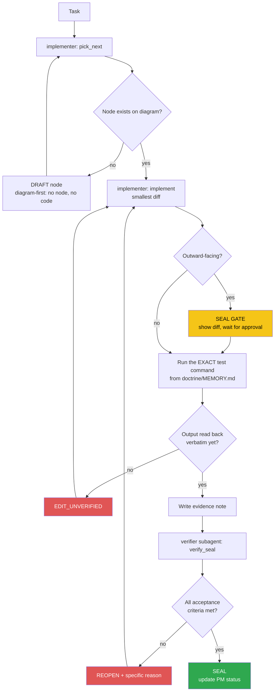

<!-- Diagram: dev-loop -->
<!-- Dev loop: plan - implement - verify - seal -->
DNA: 'smallest_diff / edit_x_read_back_proof_x_independent_verdict'
Auth: 65537 | Version: 1.0.0
Law: LAI-13 - monotonic ratchet (PENDING -> IN_PROGRESS -> SEALED, never demote)

> Every repo code change enters here and exits as SEALED or REOPENED — no
> other state exists in between.

## PM status
> Older SEALED nodes (2026-08-22 through 2026-08-25; then a 2nd pass
> 2026-08-30 covering 7 more nodes dated 2026-08-29/2026-08-30; then a
> 3rd pass 2026-09-03 covering the 4 remaining full-content SEALED rows,
> dated 2026-08-30 through 2026-09-02) moved to
> `haven/diagrams/dev-loop-archive.md` to keep this file small — every
> worker session reads this file in full. Nothing deleted: the archive
> has each row's full original text verbatim. The compact rows below
> point to it; open the archive only when you need the full story
> behind an old node. `pick_next` only needs non-archived rows. Run
> `/hub-tokens` periodically — if this file flags >15KB again, repeat
> this archiving pass for nodes older than the current work session.

| Node | State | Notes |
|---|---|---|
| `add-docx-export-format` | SEALED | 2026-09-02 — archived, see `haven/diagrams/dev-loop-archive.md`. Evidence: `evidence/implementer/2026-09-02/add-docx-export-format-diff.md`. |
| `add-pagination-filtering-cv-sections` | SEALED | GitHub issue #73. `page`/`limit`/`sort` query params on the 6 CV-section list endpoints (education/experience/award/certificate/project/reference — `generalInformation` excluded, its `GET /` returns a single document, not a list). Code already implemented and merged to `staging` via PR #106 (commit `1133f1b`, 2026-09-02) with no matching diagram node/evidence note at the time (bookkeeping gap, backfilled now by `/todo "#73"`, same pattern as `add-logout-all-sessions`/#74). Opt-in and backward compatible: omitting `limit` returns the exact old unpaginated array (`services/index.ts` `baseFindDocument`); a valid `limit` (capped at 100, `MAX_PAGE_LIMIT`) switches `data` to `{ items, pagination }`. `sort` validated against `SORT_FIELD_REGEX` allowlist in `BaseController.ts` — no `$`, can't smuggle a Mongo operator. Issue stays OPEN on GitHub because the merge landed on `staging`, not the default branch (`main`) — same expected auto-close gap as #74, not a bug. Verified 2026-09-05, evidence: `evidence/verifier/2026-09-05/add-pagination-filtering-cv-sections-seal.md`. |
| `add-logout-all-sessions` | SEALED | GitHub issue #74. `POST /api/v1/auth/logout-all` — code already implemented and merged to `staging` via PR #105 (commit `03bcb66`, 2026-09-02) with no matching diagram node/evidence note at the time (bookkeeping gap, backfilled now by `/todo "#74"`). Design deviates from the issue's `tokenVersion`-on-`Candidate` proposal: reuses the Redis/mem "invalidated-before" timestamp shape from `tokenBlacklist.ts` (`src/utils/sessionRevocation.ts`), compared against the JWT's standard `iat` in `verifyToken.middleware.ts` + `authRefreshToken` — no schema change, no extra Mongo lookup. Issue stays OPEN on GitHub because the merge landed on `staging`, not the default branch (`main`); auto-close via `Closes #74` fires only on a `main` merge per the documented release workflow — expected, not a bug. Verified 2026-09-05, evidence: `evidence/verifier/2026-09-05/add-logout-all-sessions-seal.md`. |
| `agent-hub-token-cleanup-20260830` | SEALED | 2026-08-30 — archived, see `haven/diagrams/dev-loop-archive.md`. Evidence: `evidence/implementer/2026-08-30/agent-hub-token-cleanup-diff.md`. |
| `fix-chrome-executable-path` | PENDING | `src/services/createPDF.ts:14-25` — Chrome executable path hardcoded, breaks PDF export in CI/Docker. See Traps in `doctrine/domains/PROJECT.md`. First candidate node. |
| `fix-idor-broken-access-control` | PENDING | **Critical.** All CRUD APIs for candidate_profile (education/experience/award/certificate/project/reference/generalInformation) + `candidate.service.ts` + `fnExportPDF` never cross-check `candidateId`/`_id` against `req.user._id` (JWT) — they trust client-supplied `req.body.candidateId`/`_id`. Live-tested confirmed: User B could read/delete/edit User A's data, overwrite A's profile. Root cause: `verifyToken.middleware.ts` sets `req.user` but nothing cross-checks it. Found while testing the full API (task: "test the whole API again"). |
| `fix-candidate-password-leak` | PENDING | `src/candidate/candidate.service.ts` — `handlerGetInformationByEmail` has no `.select()` at all; `handlerGetInformationById` double-wraps `whitelistSelect([select])`, making the select a permanent no-op. Result: `GET /api/v1/candidate/:email` and `PUT/PATCH /candidate/update` return the raw bcrypt password hash in the response. |
| `fix-refresh-token-expiry-unused` | PENDING | `TOKEN_EXP_IN` (`.env`, already exported in config) is never used at any `jwtSign()` call site (`auth.service.ts`, `auth.controller.ts`, `api/v1/auth/services/login.ts`) — access and refresh tokens always share the same default 1h expiry, so the refresh token is pointless. |
| `fix-v2-register-missing-await` | PENDING | `src/api/v1/auth/services/register.ts:44` — `bcryptGenerateSalt(password)` missing `await`, the Promise gets assigned straight into the Mongoose model's password field → every `POST /api/v2/auth/register` fails with a Promise→string cast error. |
| `fix-create-response-null-id` | PENDING | Minor. `BaseService.ts` `handlerCreate`'s `hookAfterSave` reassigns the local destructured `data` variable, never actually updating what `baseCreateDocument` returns → every `POST .../create` response has `data._id: null` instead of the real new ID. |
| `add-candidate-self-delete` | PENDING | Feature (not a bug). No endpoint lets a candidate delete their own account — needed to clean up 2 test accounts created during live-verification of the 5 bug fixes above on production (`livecheck+...@example.com`, `livecheckB+...@example.com`). Requirement: `DELETE /api/v1/candidate`, using only `req.user._id` (never an id from the client — follows the IDOR-safe pattern from `fix-idor-broken-access-control`), cascade-deletes data across all 7 CV section models by `candidateId`. |
| `fix-candidate-me-candidateid-not-string` | PENDING | **Critical, found by accident while testing #79.** `candidate_me/index.ts` `handlerGetAboutMe` — `_id` from the raw Mongoose document is an ObjectId instance, passed straight into `idQuerySafe.safeQuery({}, { candidateId: _id })` — `QuerySafe.safeQuery` only accepts `typeof value === 'string'`, so an ObjectId silently fails that check and `candidateId` gets dropped from the filter → `model.find({})` returns CV data (education/experience/award/certificate/project/generalInformation) for **every candidate mixed together**, on every `GET /api/me/:email` request (public, no auth) and `/download-pdf`. Live-tested confirmed: a brand-new candidate profile returned real data belonging to `votan.it@gmail.com`. Fix: `.toString()` on `_id` before passing it in. |
| `feat-i18n-api-messages-auth` | PENDING | Feature, GitHub issue #78 (phase 1 of several). i18n infrastructure (hand-rolled `t(key, lang)`, reads `locales/vi.json`/`en.json`, middleware detects `Accept-Language`, defaults `vi`) + fully migrates the auth flow (register/login/logout/refresh). Does NOT migrate Joi validation messages (different architecture — Joi schemas are built once at module load with no request context; needs error TYPE → i18n key mapping, left as a follow-up). Does NOT touch candidate/CV section messages (separate follow-up). |
| `feat-i18n-full-coverage` | PENDING | Feature, GitHub issue #78 (phase 2/2 — complete). Joi validation messages: a generic system translating by `detail.type` + `fieldLabels` (`utils/valid.ts`), no longer relying on hardcoded `.messages()` per schema. Mongoose `required` messages: same approach in `handleError` (`utils/helper.ts`). Every candidate/CV section success/error message (`services/index.ts`, `BaseController.ts`, `BaseService.ts`, `candidate.service.ts`, `generalInformation.*`) cascades across all 7 CV sections. Bug found during implementation: `t()`'s dot-path walker misparsed Joi type strings containing a dot (`any.required` was read as 3 nested levels) — caught via a real live test (curl in 2 languages), not code review. Fix: a dedicated `tErrorType()` function, flat lookup with no dot-path walking. |
| `add-visit-tracking` | SEALED | 2026-09-01 — archived, see `haven/diagrams/dev-loop-archive.md`. Evidence: `evidence/implementer/2026-09-01/add-visit-tracking-diff.md`. |
| `add-open-to-work-status` | SEALED | 2026-08-29 — archived, see `haven/diagrams/dev-loop-archive.md`. Evidence: `evidence/implementer/2026-08-29/add-open-to-work-status-plan.md`. |
| `consolidate-v1-v2-auth` | SEALED | 2026-08-29 — archived, see `haven/diagrams/dev-loop-archive.md`. Evidence: `evidence/implementer/2026-08-29/consolidate-v1-v2-auth-diff.md`. |
| `add-json-export-format` | SEALED | 2026-08-29 — archived, see `haven/diagrams/dev-loop-archive.md`. Evidence: `evidence/implementer/2026-08-29/add-json-export-format-diff.md`. |
| `add-candidate-cv-upload` | SEALED | 2026-08-29 — archived, see `haven/diagrams/dev-loop-archive.md`. Evidence: `evidence/implementer/2026-08-29/add-candidate-cv-upload-diff.md`. |
| `add-public-profile-visibility-toggle` | SEALED | 2026-08-29 — archived, see `haven/diagrams/dev-loop-archive.md`. Evidence: `evidence/implementer/2026-08-29/add-public-profile-visibility-toggle-diff.md`. |
| `add-email-verification` | SEALED | 2026-08-29 — archived, see `haven/diagrams/dev-loop-archive.md`. Evidence: `evidence/implementer/2026-08-29/add-email-verification-diff.md`. |
| `add-forgot-reset-password-flow` | SEALED | 2026-08-25 — archived, see `haven/diagrams/dev-loop-archive.md`. Evidence: `evidence/implementer/2026-08-25/forgot-password-reset-flow-plan.md`. |
| `feat-multilang-resume-content` | SEALED | 2026-08-25 — archived, see `haven/diagrams/dev-loop-archive.md`. Evidence: `evidence/verifier/2026-08-25/feat-multilang-resume-content-seal.md`. |
| `fix-pdf-missing-career-fields` | SEALED | 2026-08-25 — archived, see `haven/diagrams/dev-loop-archive.md`. Evidence: `evidence/verifier/2026-08-25/fix-pdf-missing-career-fields-seal.md`. |
| `fix-redis-init-blocks-dev-startup` | SEALED | 2026-08-22 — archived, see `haven/diagrams/dev-loop-archive.md`. Evidence: `evidence/verifier/2026-08-22/fix-redis-init-blocks-dev-startup-seal.md`. |
| `add-project-cert-award-image-upload` | SEALED | 2026-08-30 — archived, see `haven/diagrams/dev-loop-archive.md`. Evidence: `evidence/implementer/2026-08-30/add-project-cert-award-image-upload-diff.md`. |
| `fix-visit-model-missing-id` | SEALED | 2026-09-01 — archived, see `haven/diagrams/dev-loop-archive.md`. Evidence: `evidence/implementer/2026-09-01/fix-visit-model-missing-id-diff.md`. |
| `add-docker-support` | SEALED | GitHub issue #24. Adds `Dockerfile` (multi-stage: `base`/`deps`/`development`/`build`/`prod-deps`/`production`), `.dockerignore`, `docker-compose.yml` (dev — hot reload, Mongo 7, insecure built-in dev secrets so `docker compose up` works with no `.env`), `docker-compose.prod.yml` (production — compiled image, no secret defaults, Mongo not exposed to host, `HEALTHCHECK` against `/health`), + a README `🐳 Docker` section. Chromium installed via `apt` in the image (not Puppeteer's own download) with `PUPPETEER_EXECUTABLE_PATH` set — this is exactly the CI/Docker case the existing `fix-chrome-executable-path` trap in `doctrine/domains/PROJECT.md` warns about; live-verified working (see evidence), not just assumed fixed by that trap's earlier code change. Redis intentionally not containerized — app already falls back to in-memory (documented in the compose file). Round 1 REOPENed on a production port-mapping bug (`fix-prod-port-ignores-local-port`); round 2 fixed the port mapping + found and worked around a second bug (`fix-hardcoded-src-public-write-paths`) live while re-testing. SEALED 2026-09-06 after independent full re-run reproduced both fixes against the exact documented default config. Evidence: `evidence/verifier/2026-09-06/add-docker-support-round2-seal.md`. |
| `fix-prod-port-ignores-local-port` | SEALED | `src/server.ts:135` now `process.env.LOCAL_PORT ? portNumber : (_env !== 'production' ? portNumber : 3008)` — respects `LOCAL_PORT` whenever it's actually set, in every environment; still defaults to 3001 dev / 3008 prod when unset (deliberate non-regression choice, not a full drop of the special case). `docker-compose.prod.yml`/`Dockerfile` reverted from `add-docker-support` round 2's hardcoded-3008 workaround back to `${LOCAL_PORT:-3008}`/`process.env.LOCAL_PORT||3008` templating. Live-verified in Docker: unset `LOCAL_PORT` still binds/publishes 3008 (regression check); `LOCAL_PORT` set to a non-default value genuinely binds/publishes on that port and reaches `healthy`, plus a full register/login/download-pdf/self-delete round trip. Render's real production `LOCAL_PORT` value was not inspected (no dashboard access) — flagged for the operator before this ships to `main`. SEALED 2026-09-06 after independent full re-run reproduced both cases (including a distinct port value from the implementer's own test) plus tsc/build/test. Evidence: `evidence/verifier/2026-09-06/fix-prod-port-ignores-local-port-seal.md`. |
| `fix-hardcoded-src-public-write-paths` | SEALED | 3 hardcoded RELATIVE `src/public/...` write paths regardless of `NODE_ENV` (`createPDF.ts:9`, `uploadCV.middleware.ts:22`, `uploadImages.middleware.ts:19`) — not `dist/public/...`, what `express.static` actually serves in production. Found live (2026-09-06) while live-testing `docker-compose.prod.yml` for `add-docker-support`/#24 — PDF export 500'd `ENOENT` in the minimal production image (only ships `dist/`, no `src/`). Fixed: all 3 now `path.join(__dirname, ..., 'public', ...)`, matching `express.static`'s own resolution in `server.ts`; `createPDF.ts` also gained a `fs.existsSync`/`mkdirSync` self-heal it was missing. Also fixes a previously-undocumented silent-404 bug on uploaded images/CVs in any compiled deploy (including the real Render production host, not just Docker) — the old CWD-relative path never matched what `express.static` served, so uploads "succeeded" into a directory nothing ever fetched from. `Dockerfile`'s round-2 `mkdir -p src/public/...` workaround removed as no longer needed. SEALED 2026-09-06 after independent full re-run: tsc/build/test re-run clean (13/13 suites, 77/77 tests); live Docker round trip reproduced with the verifier's own throwaway account/test image/test PDF (byte-identical fetch for both the image and — beyond what the implementer live-tested — the CV upload/download round trip too); `docker exec ls /app/src` confirmed absent, ruling out "worked by accident". Evidence: `evidence/verifier/2026-09-06/fix-hardcoded-src-public-write-paths-seal.md`. |
Any regression must be a **new node** (LAI-13) — never edit an existing
node's PM status directly to "undo" an existing SEAL.
